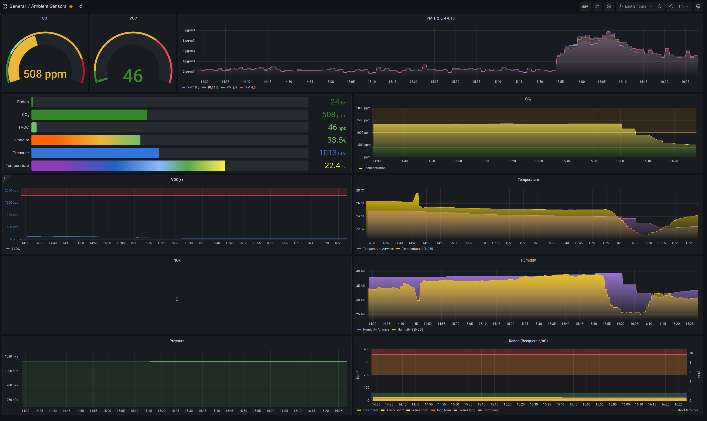

# anotter-sensor-hub

This is an ESP32-based environmental sensor hub that comes with a Prometheus interface. It is designed to work perfectly with Sensirion SEN05x sensors, such as the depictured SEN055. These sensors provide PM1, PM2.5, PM4, PM10, temperature, humidity, VOC, and NOC indices. In addition, other I2C, SPI, or PWM sensors can be added to the designated connectors. All ESP32 pins are broken out, allowing you to connect any sensor imaginable to the host board.

The PCB and components (w/o SEN055) are about ~5$, with SEN055 it comes up to ~40€/sensor node. 

<table>
  <tbody>
    <tr>
      <td>
        
      </td>
      <td>
        
      </td>
    </tr>
    <tr>
      <td colspan="2">
        
      </td>
    </tr>
  </tbody>
</table>

## Notes

 - Cable: [JST GHR 6Pin to Molex PicoBlade 6Pin](https://www.ebay.de/itm/183753208063)
 - Sensor: SEN055
